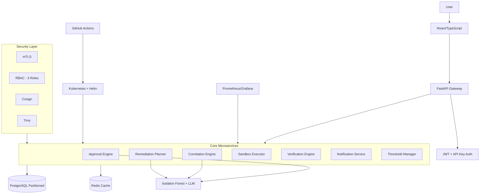

# KORAL — Graphify Knowledge Graph

**Generated:** 2026-07-18 (AIOS v2.0 Refresh)
**AIOS Graphify Version:** 1.0.0

---

## Project Structure

```
KORAL/
  backend/             — FastAPI backend
  frontend/            — React 18 + TypeScript + Vite
  ai_engine/           — AI/ML anomaly detection engine
  koral_ai_ml/         — ML pipeline
  AIML/                — ML infrastructure
  database/            — Database migrations and config
  k8s/                 — Kubernetes manifests
  helm/                — Helm charts (dev/staging/prod)
  docker/              — Docker configurations
  deploy/              — Deployment scripts
  infra/               — Infrastructure as code
  correlation-engine/  — Event correlation microservice
  approval-engine/     — Human-in-loop approval
  remediation-planner/ — Automated remediation planning
  sandbox-executor/    — Sandboxed execution
  notification/        — Notification service
  notifier/            — Alternative notifier
  feedback/            — Feedback collection
  threshold/           — Threshold management
  verification-engine/ — Verification microservice
  tests/               — Test suites
  load_tests/          — Load testing (Locust)
  data/                — Data files
  shared/              — Shared libraries
  system-intelligence-evaluation/ — System evaluation
  docs/                — Documentation
  agents/              — Agent definitions
```

## Technology Nodes

| Node | Type | Version |
|---|---|---|
| Python | language | 3.11 |
| FastAPI | framework | 0.x |
| SQLAlchemy | orm | 2.x |
| React | framework | 18.x |
| TypeScript | language | 5.x |
| Vite | build-tool | 5.x |
| PostgreSQL | database | 16.x (partitioned) |
| Redis | cache | 7.x |
| Prometheus | monitoring | latest |
| Grafana | visualization | latest |
| Docker | container | latest |
| Kubernetes | orchestration | latest |
| Helm | package-manager | 3.x |
| GitHub Actions | ci-cd | — |
| scikit-learn | ml-library | Isolation Forest |
| OpenAI GPT-4o | llm | — |
| Anthropic Claude | llm | — |
| Locust | load-testing | latest |
| mTLS | security | cert-manager |
| Cosign | signing | image-signing |
| Trivy | security | sbom-scanning |

## Dependency Graph



## Microservice Boundaries

| Service | Description | Depends On |
|---|---|---|
| anomaly-detection | CPU/Memory/Storage/Log anomaly detection | database, redis |
| correlation-engine | Isolation Forest event correlation | database |
| remediation-planner | LLM-driven remediation planning | database, llm |
| approval-engine | Human-in-loop approval workflows | database |
| sandbox-executor | Sandboxed remediation execution | k8s |
| verification-engine | Post-remediation verification | database |
| notification | Alert notification dispatch | database |
| threshold | SLO/SLA threshold management | database |

## Entry Points

| Name | Path | Type |
|---|---|---|
| Backend | backend/main.py | server |
| Frontend | frontend/src/ | app |
| Helm Chart | helm/koral/ | infra |
| Docker Compose | docker-compose.yml | infra |
| CI Pipeline | .github/workflows/ci.yml | ci/cd |

## AIOS Integration Points

- **Context Load:** `backend/`, `frontend/`, `ai_engine/`, `helm/`
- **Graphify Path:** `graphify-out/`
- **Memory Path:** `AIOS/memory/projects/KORAL/`
- **Documentation:** `README.md`, `CLAUDE.md`
